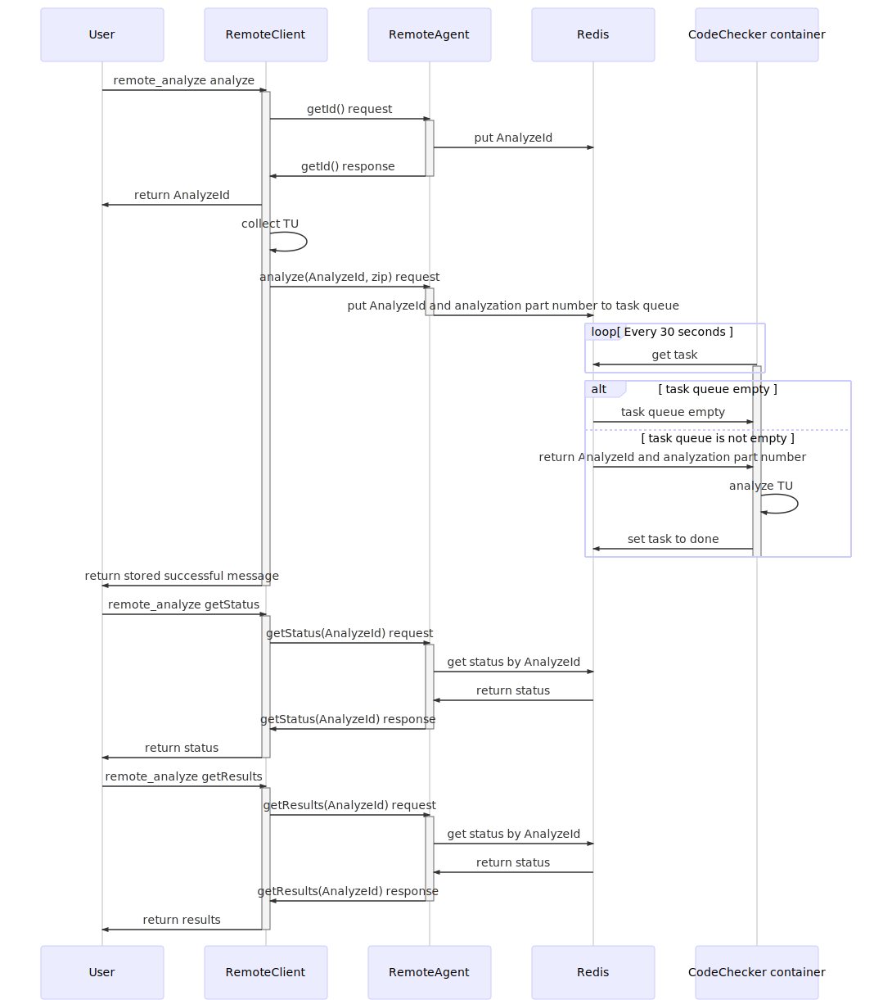

# Thesis

- [ ] Bevezetes 2-3
  - [ ] Cel
  - [ ] Eredmenyek
- [ ] Cloud (altalanossagban) 10-15
  - [ ] Cloud
  - [ ] Microservices
- [ ] Nagyvonalakban az implementaciorol 5 (?)
- [ ] Implementacio 15
  - [ ] Kapcsolodas a CodeCheckerrel 1
  - [ ] Komponensek
    - [ ] Client 1
      - [ ] TU Collector
      - [ ] Mit csinal
    - [ ] Server 4
      - [ ] Mit csinal
      - [ ] File caching
        - [ ] Standard library, meg a sajat kodok is ritkan valtozik
    - [ ] Adatbazis schema 2
      - [ ] Miert REDIS 1
      - [ ] Milyen adatokat tarolunk le
      - [ ] Problemak (?)
    - [ ] Meresek 5
      - [ ] Tesztkornyezet 1
      - [ ] Projektek
        - [ ] TMUX (50-100)
        - [ ] Xerces (400-800)
        - [ ] LLVM (3000)
      - [ ] Osszegzes 1
        - [ ] Diagrammok
- [ ] Osszefoglalas 5
  - [ ] Authentication
  - [ ] Authorization
  - [ ] Sensitive code handling
  - [ ] Swarm
  - [ ] Dynamic scaling - Kubernetes
  - [ ] Konkluzio
  
Osszesen 38-44

# Remote CodeChecker

Diagram about the concept

<a>
  
</a>

## Getting Started

### macOS

Go through on the Docker for Mac installation guide:
https://docs.docker.com/docker-for-mac/install/

#### CodeChecker part

```sh
# Check out my forked CodeChecker source code.
git clone https://github.com/tmsblgh/codechecker
cd codechecker

# Build Docker container in it.
docker build -t codechecker .
```

#### Remote CodeChecker part

```sh
# Check out Remote CodeChecker source code.
git clone https://github.com/tmsblgh/remote_codechecker
cd remote_codechecker

# Generate thrift APIs.
make compile_thrift

# Build Docker container.
make build_docker

# Build Redis container and start all previously created container for the service.
# Note: use --scale analyzer={NUMBER_OF_ANALYZERS} for more analyzer container.
docker-compose up

# Start an analyze with the provided test resources
python3 remote_analyze.py analyze -cdb ../test/compile_commands.json
```

## Usage

```sh
# Start an analyze with build command
python3 remote_analyze.py analyze -b "g++ -c ../test/call_and_message.cpp -Wno-all -Wno-extra"

# Start an analyze with compile_commands.json
python3 remote_analyze.py analyze -cdb ../test/compile_commands.json

# Note: You can create compile_commands.json with the help of CodeChecker log or intercept-build.
```

## Notes

Files from other repositories:

client/tu_collector.py is a copy from the original CodeChecker repository
(https://github.com/Ericsson/codechecker)
