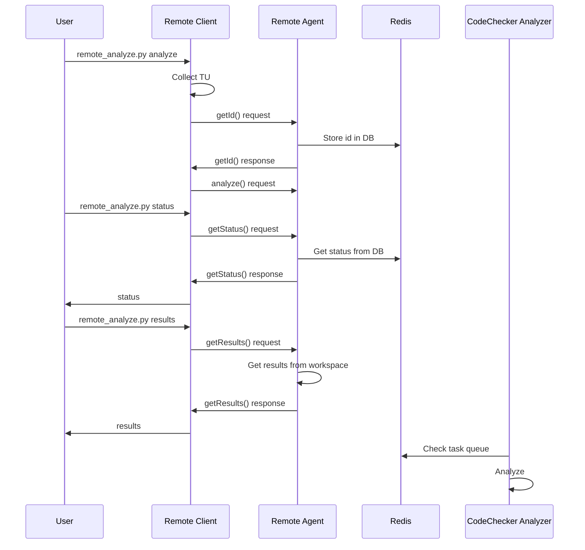

  

```mermaid

sequenceDiagram

User ->> Remote Client: remote_analyze.py analyze

Remote Client ->> Remote Client: Collect TU

Remote Client ->> Remote Agent: getId() request

Remote Agent ->> Redis: Store id in DB

Remote Agent ->> Remote Client: getId() response

Remote Client ->> Remote Agent: analyze() request

User ->> Remote Client: remote_analyze.py status

Remote Client ->> Remote Agent: getStatus() request

Remote Agent ->> Redis: Get status from DB

Remote Agent ->> Remote Client: getStatus() response

Remote Client ->> User: status

User ->> Remote Client: remote_analyze.py results

Remote Client ->> Remote Agent: getResults() request

Remote Agent ->> Remote Agent: Get results from workspace

Remote Agent->> Remote Client: getResults() response

Remote Client ->> User: results

CodeChecker Analyzer ->> Redis: Check task queue

CodeChecker Analyzer ->> CodeChecker Analyzer: Analyze

  

```
<!--stackedit_data:
eyJoaXN0b3J5IjpbLTE5MzI4NTA3NzFdfQ==
-->